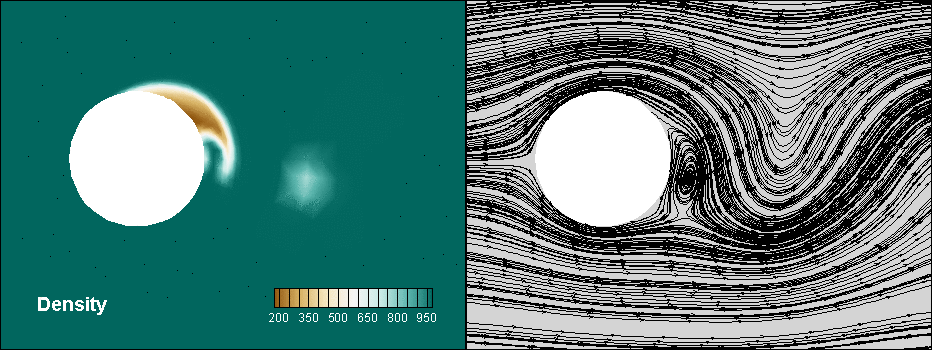
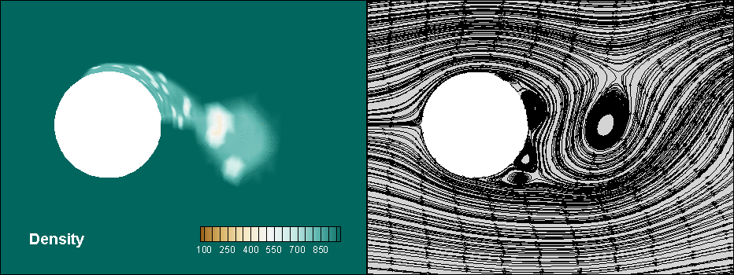

## Numerical Simulation of a Cavitating Flow over a Cylinder using a Hybrid Model
This project presents the results from a numerical simulation of a cavitating flow over a cylinder in a 2D domain using the cavitation model proposed by Kubota [1] as well as a modified turbulent viscosity formulation. 

The base model includes the results obtained in the simulation where only a modified turbulent viscosity formulation was included. The hybrid model contains the implementation of Kubota's model for cavitating flows that also includes the modified turbulent viscosity formulation used in the base model.

### Base Model

### Hybrid Model

The density and streamline visualizations for both models are as shown above. The main difference in both models is the additional capture of shear-layer instabilities evident in the streamline visualization using the hybrid model. Both simulations were ran in ANSYS Fluent 2019R2 and post-processed in Tecplot 360.

[1] A. Kubota, H. Kato, and H. Yamaguchi. “A new modelling of cavitating flows: a numerical study of unsteady cavitation on a hydrofoil section”. J. Fluid Mech. 240 (1992), pp. 59–96.
